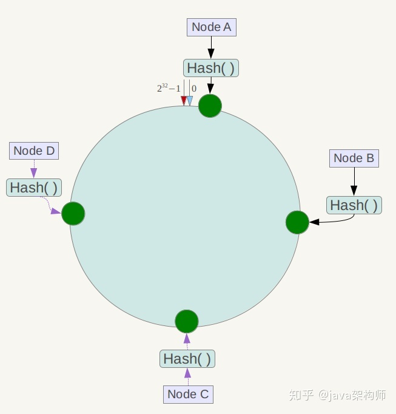
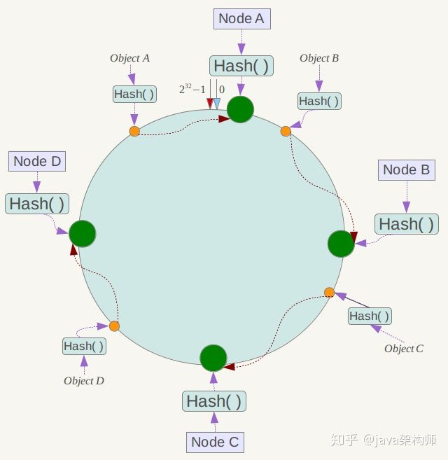
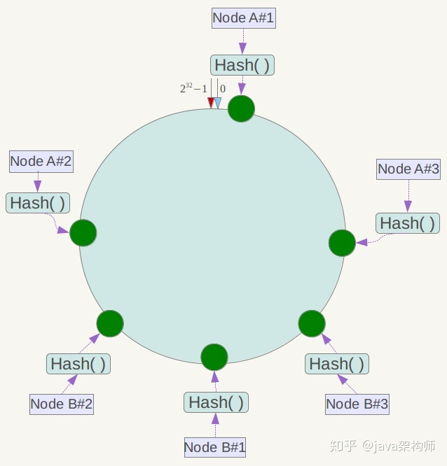

> 散列函数（英语：Hash function）又称散列算法、哈希函数，是一种从任何一种数据中创建小的数字“指纹”的方法。散列函数把消息或数据压缩成摘要，使得数据量变小，将数据的格式固定下来。该函数将数据打乱混合，重新创建一个叫做散列值（hash values，hash codes，hash sums，或hashes）的指纹。散列值通常用一个短的随机字母和数字组成的字符串来代表。好的散列函数在输入域中很少出现散列冲突。在散列表和数据处理中，不抑制冲突来区别数据，会使得数据库记录更难找到。

#### 普通的 hash 算法在分布式应用中的不足:
比如，在分布式的存储系统中，要将数据存储到具体的节点上，如果我们采用普通的 `hash` 算法进行路由，将数据映射到具体的节点上，如 `key % N`，`key` 是数据的 `key`，`N` 是机器节点数，如果有一个机器加入或退出这个集群，则会导致大量的数据映射都无效了，如果是持久化存储则要做数据迁移，如果是分布式缓存，则其他缓存就失效了。

#### 一致性哈希算法
一致性哈希提出了在动态变化的Cache环境中，哈希算法应该满足的4个适应条件

1. 均衡性(Balance)
平衡性是指哈希的结果能够尽可能分布到所有的缓冲中去，这样可以使得所有的缓冲空间都得到利用。很多哈希算法都能够满足这一条件。

2. 单调性(Monotonicity)
   - 单调性是指如果已经有一些内容通过哈希分派到了相应的缓冲中，又有新的缓冲区加入到系统中，那么哈希的结果应能够保证原有已分配的内容可以被映射到新的缓冲区中去，而不会被映射到旧的缓冲集合中的其他缓冲区。（这段翻译信息有负面价值的，当缓冲区大小变化时一致性哈希(Consistent hashing)尽量保护已分配的内容不会被重新映射到新缓冲区。）
   - 其实我自己对于单调性的理解是这样的, 结合图形理解会更加容易一些, 有新的缓冲区加入到系统中, 那么他截断的地方到它的上一个缓存点(规定以顺时针为正方向)的那部分区间的内容将会被映射到新的缓冲区, 而不会映射到原来的缓冲区, 因为如果映射到原来的缓冲区, 相当于是跨过了新的缓冲区, 这一点可能就不符合单调性的定义, 然后一致性哈希算法要尽可能的保证原有缓存的有效性, 意思就是说原来分配的内容尽量不要变动位置, 尽可能的减少已经分配的内容被重新映射到新缓冲区.

3. 分散性(Spread)
在分布式环境中，终端有可能看不到所有的缓冲，而是只能看到其中的一部分。当终端希望通过哈希过程将内容映射到缓冲上时，由于不同终端所见的缓冲范围有可能不同，从而导致哈希的结果不一致，最终的结果是相同的内容被不同的终端映射到不同的缓冲区中。这种情况显然是应该避免的，因为它导致相同内容被存储到不同缓冲中去，降低了系统存储的效率。分散性的定义就是上述情况发生的严重程度。好的哈希算法应能够尽量避免不一致的情况发生，也就是尽量降低分散性。

4. 负载(Load)
负载问题实际上是从另一个角度看待分散性问题。既然不同的终端可能将相同的内容映射到不同的缓冲区中，那么对于一个特定的缓冲区而言，也可能被不同的用户映射为不同的内容。与分散性一样，这种情况也是应当避免的，因此好的哈希算法应能够尽量降低缓冲的负荷。

#### 具体设计
按照常用的hash算法来将对应的key哈希到一个具有2^32次方个节点的空间中，即0 ~ (2^32)-1的数字空间中。现在我们可以将这些数字头尾相连，想象成一个闭合的环形。

1. 映射服务器节点 

将各个服务器使用Hash进行一个哈希，具体可以选择服务器的ip或唯一主机名作为关键字进行哈希，这样每台机器就能确定其在哈希环上的位置。假设我们将四台服务器使用ip地址哈希后在环空间的位置如下：

2. 映射数据

3. 服务器的删除与添加 
- 3.1 如果此时NodeC宕机了，此时Object A、B、D不会受到影响，只有Object C会重新分配到Node D上面去，而其他数据对象不会发生变化
- 3.2 如果在环境中新增一台服务器Node X，通过hash算法将Node X映射到环中，通过按顺时针迁移的规则，那么Object C被迁移到了Node X中，其它对象还保持这原有的存储位置。通过对节点的添加和删除的分析，一致性哈希算法在保持了单调性的同时，还是数据的迁移达到了最小，这样的算法对分布式集群来说是非常合适的，避免了大量数据迁移，减小了服务器的的压力。

4. 虚拟节点
到目前为止一致性hash也可以算做完成了，但是有一个问题还需要解决，那就是平衡性。从下图我们可以看出，当服务器节点比较少的时候，会出现一个问题，就是此时必然造成大量数据集中到一个节点上面，极少数数据集中到另外的节点上面.为了解决这种数据倾斜问题，一致性哈希算法引入了虚拟节点机制，即对每一个服务节点计算多个哈希，每个计算结果位置都放置一个此服务节点，称为虚拟节点。具体做法可以先确定每个物理节点关联的虚拟节点数量，然后在ip或者主机名后面增加编号。例如上面的情况，可以为每台服务器计算三个虚拟节点，于是可以分别计算 “Node A#1”、“Node A#2”、“Node A#3”、“Node B#1”、“Node B#2”、“Node B#3”的哈希值，于是形成六个虚拟节点：

同时数据定位算法不变，只是多了一步虚拟节点到实际节点的映射，例如定位到“Node A#1”、“Node A#2”、“Node A#3”三个虚拟节点的数据均定位到Node A上。这样就解决了服务节点少时数据倾斜的问题。每个物理节点关联的虚拟节点数量就根据具体的生产环境情况在确定。

#### 实战代码见 java 目录
