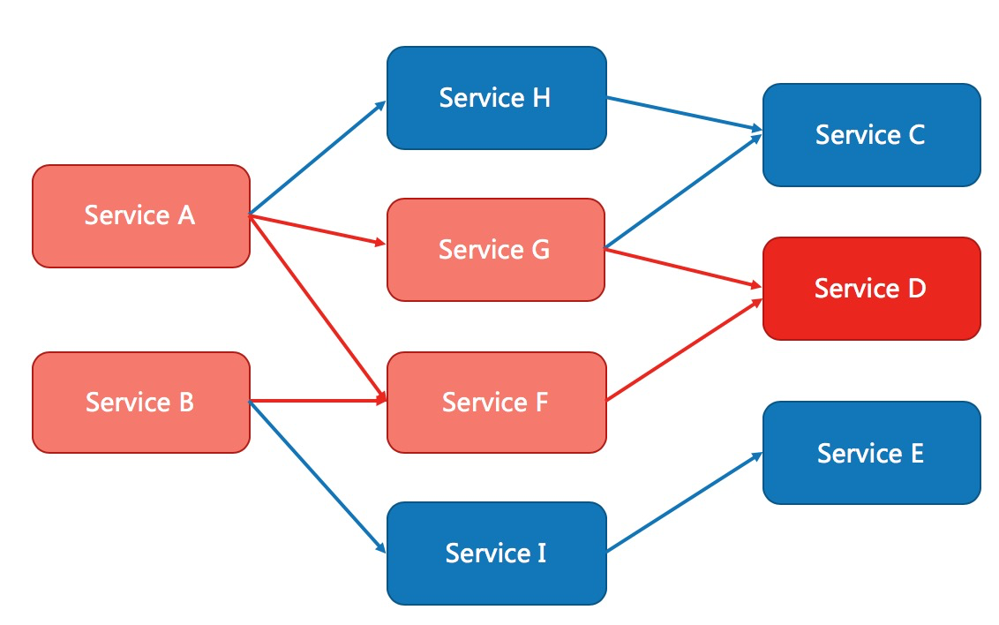

**Sentinel 基本概念**
---
#### 资源
资源是 Sentinel 的关键概念。它可以是 Java 应用程序中的任何内容，例如，由应用程序提供的服务，或由应用程序调用的其它应用提供的服务，甚至可以是一段代码。在接下来的文档中，我们都会用资源来描述代码块。

只要通过 Sentinel API 定义的代码，就是资源，能够被 Sentinel 保护起来。大部分情况下，可以使用方法签名，URL，甚至服务名称作为资源名来标示资源。

#### 规则
围绕资源的实时状态设定的规则，可以包括流量控制规则、熔断降级规则以及系统保护规则。所有规则可以动态实时调整。


#### 熔断降级
##### 什么是熔断降级
除了流量控制以外，降低调用链路中的不稳定资源也是 Sentinel 的使命之一。由于调用关系的复杂性，如果调用链路中的某个资源出现了不稳定，最终会导致请求发生堆积。这个问题和 Hystrix 里面描述的问题是一样的。



`Sentinel` 和 `Hystrix` 的原则是一致的: 当调用链路中某个资源出现不稳定，例如，表现为 timeout，异常比例升高的时候，则对这个资源的调用进行限制，并让请求快速失败，避免影响到其它的资源，最终产生雪崩的效果。

#### 熔断降级设计理念
在限制的手段上，`Sentinel` 和 `Hystrix` 采取了完全不一样的方法。

`Hystrix` 通过 `线程池` 的方式，来对依赖(在我们的概念中对应资源)进行了隔离。这样做的好处是资源和资源之间做到了最彻底的隔离。缺点是除了增加了线程切换的成本，还需要预先给各个资源做线程池大小的分配。

`Sentinel` 对这个问题采取了两种手段:
- 通过并发线程数进行限制
和资源池隔离的方法不同，Sentinel 通过限制资源并发线程的数量，来减少不稳定资源对其它资源的影响。这样不但没有线程切换的损耗，也不需要您预先分配线程池的大小。当某个资源出现不稳定的情况下，例如响应时间变长，对资源的直接影响就是会造成线程数的逐步堆积。当线程数在特定资源上堆积到一定的数量之后，对该资源的新请求就会被拒绝。堆积的线程完成任务后才开始继续接收请求。 

- 通过响应时间对资源进行降级
除了对并发线程数进行控制以外，Sentinel 还可以通过响应时间来快速降级不稳定的资源。当依赖的资源出现响应时间过长后，所有对该资源的访问都会被直接拒绝，直到过了指定的时间窗口之后才重新恢复。

**定义资源**
#### 方式一：主流框架的默认适配
为了减少开发的复杂程度，我们对大部分的主流框架，例如 Web Servlet、Dubbo、Spring Cloud、gRPC、Spring WebFlux、Reactor 等都做了适配。您只需要引入对应的依赖即可方便地整合 Sentinel。可以参见：[主流框架的适配](https://sentinelguard.io/zh-cn/docs/open-source-framework-integrations.html)。

#### 方式二：抛出异常的方式定义资源
`SphU` 包含了 try-catch 风格的 API。用这种方式，当资源发生了限流之后会抛出 `BlockException`。这个时候可以捕捉异常，进行限流之后的逻辑处理。示例代码如下:
```java
// 1.5.0 版本开始可以利用 try-with-resources 特性
// 资源名可使用任意有业务语义的字符串，比如方法名、接口名或其它可唯一标识的字符串。
try (Entry entry = SphU.entry("resourceName")) {
  // 被保护的业务逻辑
  // do something here...
} catch (BlockException ex) {
  // 资源访问阻止，被限流或被降级
  // 在此处进行相应的处理操作
}
```
**特别地**，若 entry 的时候传入了热点参数，那么 exit 的时候也一定要带上对应的参数（`exit(count, args)`），否则可能会有统计错误。这个时候不能使用 try-with-resources 的方式。另外通过 `Tracer.trace(ex)` 来统计异常信息时，由于 try-with-resources 语法中 catch 调用顺序的问题，会导致无法正确统计异常数，因此统计异常信息时也不能在 try-with-resources 的 catch 块中调用 `Tracer.trace(ex)`。

1.5.0 之前的版本的示例：

```java
Entry entry = null;
// 务必保证finally会被执行
try {
  // 资源名可使用任意有业务语义的字符串
  entry = SphU.entry("自定义资源名");
  // 被保护的业务逻辑
  // do something...
} catch (BlockException e1) {
  // 资源访问阻止，被限流或被降级
  // 进行相应的处理操作
} finally {
  if (entry != null) {
    entry.exit();
  }
}
```
**注意**： `SphU.entry(xxx)` 需要与 `entry.exit()` 方法成对出现，匹配调用，否则会导致调用链记录异常，抛出 `ErrorEntryFreeException` 异常。

#### 方式三：返回布尔值方式定义资源
`SphO` 提供 if-else 风格的 API。用这种方式，当资源发生了限流之后会返回 `false`，这个时候可以根据返回值，进行限流之后的逻辑处理。示例代码如下:
```java
  // 资源名可使用任意有业务语义的字符串
  if (SphO.entry("自定义资源名")) {
          // 务必保证finally会被执行
          try {
          /**
           * 被保护的业务逻辑
           */
          } finally {
          SphO.exit();
          }
          } else {
          // 资源访问阻止，被限流或被降级
          // 进行相应的处理操作
          }
```

#### 方式四：注解方式定义资源
Sentinel 支持通过 `@SentinelResource` 注解定义资源并配置 `blockHandler` 和 `fallback` 函数来进行限流之后的处理。示例：

```java
// 原本的业务方法.
@SentinelResource(blockHandler = "blockHandlerForGetUser")
public User getUserById(String id) {
throw new RuntimeException("getUserById command failed");
}

// blockHandler 函数，原方法调用被限流/降级/系统保护的时候调用
public User blockHandlerForGetUser(String id, BlockException ex) {
return new User("admin");
}
```
注意 `blockHandler` 函数会在原方法被限流/降级/系统保护的时候调用，而 `fallback` 函数会针对所有类型的异常。请注意 `blockHandler` 和 `fallback` 函数的形式要求，更多指引可以参见 [Sentinel 注解支持文档](https://sentinelguard.io/zh-cn/docs/annotation-support.html)。

#### 方式五：异步调用支持
Sentinel 支持异步调用链路的统计。在异步调用中，需要通过 `SphU.asyncEntry(xxx)` 方法定义资源，并通常需要在异步的回调函数中调用 `exit` 方法。以下是一个简单的示例：
```java
try {
    AsyncEntry entry = SphU.asyncEntry(resourceName);

    // 异步调用.
    doAsync(userId, result -> {
        try {
            // 在此处处理异步调用的结果.
        } finally {
            // 在回调结束后 exit.
            entry.exit();
        }
    });
} catch (BlockException ex) {
    // Request blocked.
    // Handle the exception (e.g. retry or fallback).
}
```
`SphU.asyncEntry(xxx)` 不会影响当前（调用线程）的 Context，因此以下两个 entry 在调用链上是平级关系（处于同一层），而不是嵌套关系：
```java
// 调用链类似于：
// -parent
// ---asyncResource
// ---syncResource
asyncEntry = SphU.asyncEntry(asyncResource);
entry = SphU.entry(normalResource);
```
若在异步回调中需要嵌套其它的资源调用（无论是 `entry` 还是 `asyncEntry`），只需要借助 Sentinel 提供的上下文切换功能，在对应的地方通过 `ContextUtil.runOnContext(context, f)` 进行 Context 变换，将对应资源调用处的 Context 切换为生成的异步 Context，即可维持正确的调用链路关系。示例如下：
```java
public void handleResult(String result) {
    Entry entry = null;
    try {
        entry = SphU.entry("handleResultForAsync");
        // Handle your result here.
    } catch (BlockException ex) {
        // Blocked for the result handler.
    } finally {
        if (entry != null) {
            entry.exit();
        }
    }
}

public void someAsync() {
    try {
        AsyncEntry entry = SphU.asyncEntry(resourceName);

        // Asynchronous invocation.
        doAsync(userId, result -> {
            // 在异步回调中进行上下文变换，通过 AsyncEntry 的 getAsyncContext 方法获取异步 Context
            ContextUtil.runOnContext(entry.getAsyncContext(), () -> {
                try {
                    // 此处嵌套正常的资源调用.
                    handleResult(result);
                } finally {
                    entry.exit();
                }
            });
        });
    } catch (BlockException ex) {
        // Request blocked.
        // Handle the exception (e.g. retry or fallback).
    }
}
```
此时的调用链就类似于：
```java
-parent
---asyncInvocation
-----handleResultForAsync
```

### 其它 API
#### 业务异常统计 Tracer
业务异常记录类 `Tracer` 用于记录业务异常。相关方法：

- `trace(Throwable e)`：记录业务异常（非 `BlockException` 异常），对应的资源为当前线程 context 下 entry 对应的资源。
- `trace(Throwable e, int count)`：记录业务异常（非 `BlockException` 异常），异常数目为传入的 `count`。
- `traceEntry(Throwable, int, Entry)`：向传入 entry 对应的资源记录业务异常（非 `BlockException` 异常），异常数目为传入的 `count`。
如果用户通过 `SphU` 或 `SphO` 手动定义资源，则 Sentinel 不能感知上层业务的异常，需要手动调用 `Tracer.trace(ex)` 来记录业务异常，否则对应的异常不会统计到 Sentinel 异常计数中。注意不要在 try-with-resources 形式的 `SphU.entry(xxx)` 中使用，否则会统计不上。

从 1.3.1 版本开始，注解方式定义资源支持自动统计业务异常，无需手动调用 `Tracer.trace(ex)` 来记录业务异常。Sentinel 1.3.1 以前的版本需要手动记录。

#### 上下文工具类 ContextUtil
相关静态方法：

##### 标识进入调用链入口（上下文）：

以下静态方法用于标识调用链路入口，用于区分不同的调用链路：

- `public static Context enter(String contextName)`
- `public static Context enter(String contextName, String origin)`
其中 `contextName` 代表调用链路入口名称（上下文名称），`origin` 代表调用来源名称。默认调用来源为空。返回值类型为 `Context`，即生成的调用链路上下文对象。

**注意**：`ContextUtil.enter(xxx)` 方法仅在调用链路入口处生效，即仅在当前线程的初次调用生效，后面再调用不会覆盖当前线程的调用链路，直到 exit。`Context` 存于 ThreadLocal 中，因此切换线程时可能会丢掉，如果需要跨线程使用可以结合 `runOnContext` 方法使用。

流控规则中若选择“流控方式”为“链路”方式，则入口资源名即为上面的 `contextName`。

##### 退出调用链（清空上下文）：
- `public static void exit()`：该方法用于退出调用链，清理当前线程的上下文。

##### 获取当前线程的调用链上下文：
- `public static Context getContext()`：获取当前线程的调用链路上下文对象。

##### 在某个调用链上下文中执行代码：
- `public static void runOnContext(Context context, Runnable f)`：常用于异步调用链路中 context 的变换。


### @SentinelResource 注解
---
> 注意：注解方式埋点不支持 private 方法。

`@SentinelResource` 用于定义资源，并提供可选的异常处理和 fallback 配置项。 `@SentinelResource` 注解包含以下属性：

- `value`：资源名称，必需项（不能为空） 
- `entryType`：entry 类型，可选项（默认为 `EntryType.OUT`）
- `blockHandler` / `blockHandlerClass`: `blockHandler` 对应处理 `BlockException` 的函数名称，可选项。blockHandler 函数访问范围需要是 `public`，返回类型需要与原方法相匹配，参数类型需要和原方法相匹配并且最后加一个额外的参数，类型为 `BlockException`。blockHandler 函数默认需要和原方法在同一个类中。若希望使用其他类的函数，则可以指定 `blockHandlerClass` 为对应的类的 `Class` 对象，注意对应的函数必需为 `static` 函数，否则无法解析。 
- `fallback`：fallback 函数名称，可选项，用于在抛出异常的时候提供 fallback 处理逻辑。fallback 函数可以针对所有类型的异常（除了 `exceptionsToIgnore` 里面排除掉的异常类型）进行处理。fallback 函数签名和位置要求：
  - 返回值类型必须与原函数返回值类型一致； 
  - 方法参数列表需要和原函数一致，或者可以额外多一个 `Throwable` 类型的参数用于接收对应的异常。 
  - fallback 函数默认需要和原方法在同一个类中。若希望使用其他类的函数，则可以指定 `fallbackClass` 为对应的类的 `Class` 对象，注意对应的函数必需为 static 函数，否则无法解析。
- `defaultFallback`（since 1.6.0）：默认的 fallback 函数名称，可选项，通常用于通用的 fallback 逻辑（即可以用于很多服务或方法）。默认 fallback 函数可以针对所以类型的异常（除了 `exceptionsToIgnore` 里面排除掉的异常类型）进行处理。若同时配置了 fallback 和 defaultFallback，则只有 fallback 会生效。defaultFallback 函数签名要求：
  - 返回值类型必须与原函数返回值类型一致； 
  - 方法参数列表需要为空，或者可以额外多一个 `Throwable` 类型的参数用于接收对应的异常。
  defaultFallback 函数默认需要和原方法在同一个类中。若希望使用其他类的函数，则可以指定 `fallbackClass` 为对应的类的 `Class` 对象，注意对应的函数必需为 static 函数，否则无法解析。 
  - `exceptionsToIgnore`（since 1.6.0）：用于指定哪些异常被排除掉，不会计入异常统计中，也不会进入 fallback 逻辑中，而是会原样抛出。 
> 注：1.6.0 之前的版本 fallback 函数只针对降级异常（`DegradeException`）进行处理，**不能针对业务异常进行处理**。

特别地，若 blockHandler 和 fallback 都进行了配置，则被限流降级而抛出 `BlockException` 时只会进入 `blockHandler` 处理逻辑。若未配置 `blockHandler`、`fallback` 和 `defaultFallback`，则被限流降级时会将 `BlockException` **直接抛出**。
示例：
```java
public class TestService {

    // 对应的 `handleException` 函数需要位于 `ExceptionUtil` 类中，并且必须为 static 函数.
    @SentinelResource(value = "test", blockHandler = "handleException", blockHandlerClass = {ExceptionUtil.class})
    public void test() {
        System.out.println("Test");
    }

    // 原函数
    @SentinelResource(value = "hello", blockHandler = "exceptionHandler", fallback = "helloFallback")
    public String hello(long s) {
        return String.format("Hello at %d", s);
    }
    
    // Fallback 函数，函数签名与原函数一致或加一个 Throwable 类型的参数.
    public String helloFallback(long s) {
        return String.format("Halooooo %d", s);
    }

    // Block 异常处理函数，参数最后多一个 BlockException，其余与原函数一致.
    public String exceptionHandler(long s, BlockException ex) {
        // Do some log here.
        ex.printStackTrace();
        return "Oops, error occurred at " + s;
    }
}
```
从 1.4.0 版本开始，注解方式定义资源支持自动统计业务异常，无需手动调用 `Tracer.trace(ex)` 来记录业务异常。Sentinel 1.4.0 以前的版本需要自行调用 `Tracer.trace(ex)` 来记录业务异常。


### 动态规则扩展
我们推荐**通过控制台设置规则后将规则推送到统一的规则中心，客户端实现 `ReadableDataSource` 接口端监听规则中心实时获取变更**，流程如下：

#### 推模式扩展
实现推模式的数据源最简单的方式是继承 `AbstractDataSource` 抽象类，在其构造方法中添加监听器，并实现 readSource() 从指定数据源读取字符串格式的配置数据。比如 基于 Nacos 的数据源。


### 启动配置项
阿里云生产环境 注册到 dashboard 的应用显示的不是应用名称而是 服务 id, 显示不够直观. 可以在各个应用的启动参数中加上如下配置
```shell
-Dcsp.sentinel.app.name=appName
```

### Sentinel 控制台
3. 客户端接入控制台
```yaml
spring:
  cloud:
    sentinel:
      transport:
        # 生产环境可能为 dashboard: xxx.xxx.xxx.xxx:80(这里很奇怪, 一般来说应该是服务端口 7733, 但是在外网访问时竟然是外网 ip 和对外的 80 端口
        dashboard: 127.0.0.1:7733
```

6. 规则管理及推送
Sentinel 同时还提供应用维度规则推送的示例页面（流控规则页面，前端路由为 `/v2/flow`），用户改造控制台对接配置中心后可直接通过 v2 页面推送规则至配置中心。Sentinel 抽取了通用接口用于向远程配置中心推送规则以及拉取规则：

- `DynamicRuleProvider<T>`: 拉取规则（应用维度）
- `DynamicRulePublisher<T>`: 推送规则（应用维度）
用户只需实现 `DynamicRuleProvider` 和 `DynamicRulePublisher` 接口，并在 v2 的 controller 中通过 `@Qualifier` 注解替换相应的 bean 即可实现应用维度推送。我们提供了 Nacos 和 Apollo 的示例，改造详情可参考 [应用维度规则推送示例](https://github.com/alibaba/Sentinel/wiki/Sentinel-%E6%8E%A7%E5%88%B6%E5%8F%B0%EF%BC%88%E9%9B%86%E7%BE%A4%E6%B5%81%E6%8E%A7%E7%AE%A1%E7%90%86%EF%BC%89#%E8%A7%84%E5%88%99%E9%85%8D%E7%BD%AE)。
由于默认的提供的控制台是无法将在控制台修改的规则持久化到 `nacos`中, 虽然它也能即时应用规则生效, 但是没有持久化到 `nacos` 就会导致一个问题, 由于规则生效是在内存态的, 下一次服务重启从 nacos 中读取规则配置的时候, 由于上次设置的规则没有持久化到 `nacos`中, 自然就无法应用上一次设置的规则, 解决办法有两种. 第一就是自己手动的去 `nacos` 修改规则配置, 第二种办法就是想办法让 `dashboard` 设置的规则能够持久化到 `nacos` 中, 第二种方法是需要改造的, 官方也提供了一些相应的提示. 具体的改造见参考文档
- https://blog.csdn.net/h273979586/article/details/115596602
- https://www.cnblogs.com/jian0110/p/14139044.html
- https://blog.csdn.net/a1036645146/article/details/107844149

---
总体参考文档:
- https://sentinelguard.io/zh-cn/docs/faq.html
- https://sentinelguard.io/zh-cn/index.html
